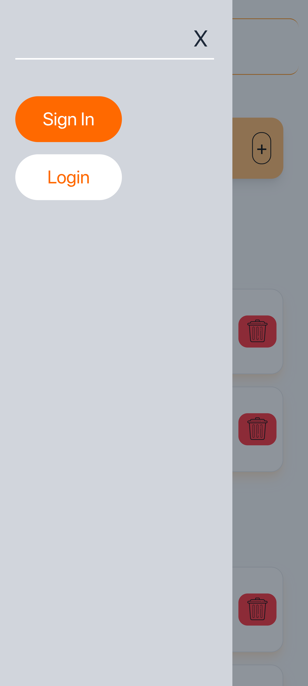
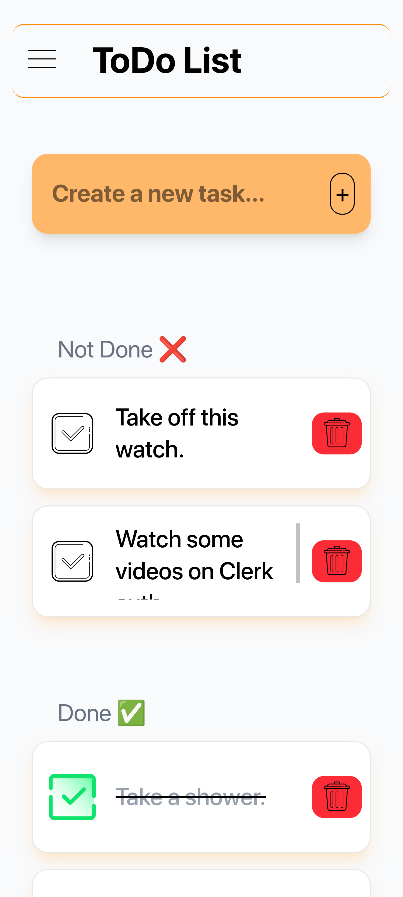

# This is a [ToDoList App](https://t0d0-list-app.vercel.app/) project bootstrapped with [`create-next-app`](https://github.com/vercel/next.js/tree/canary/packages/create-next-app).

- Click the `+` button (or hit `Enter`) to add a task.
- Click the red trash icon to delete a task.
- Click the checkmark to mark a task as done.
- Directly click on a task's text to edit.
- Play around with the app.

## ToDo
- [x] Add a task
- [x] Delete a task
- [x] Edit a task
- [x] Mark as done.
- [ ] Use localStorage to cache taskText.
- [ ] Add authentication.
- [ ] Connect a database. 